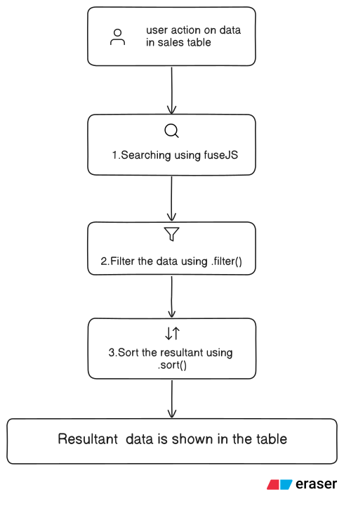

## Workflow architecture



## Folder structure and module responsibility
```
src/
│    
├── components/
│   ├── SearchBar.jsx           // hosts ui search bar component
│   │
│   ├── Filters.jsx             // hosts ui filtering component
│   │
│   ├── SalesTable.jsx          // responsible for table rendering
│   │
│   ├── Pagination.jsx          // hosts ui for pagination
|
├── hooks/
│   └── useSalesData.js       // fetchs data & applies workflow sequence
│
├── data/
│   └── dummySales.json         // holds dummy data present in the ui
│
└── App.jsx                     // renders the dashboard
```